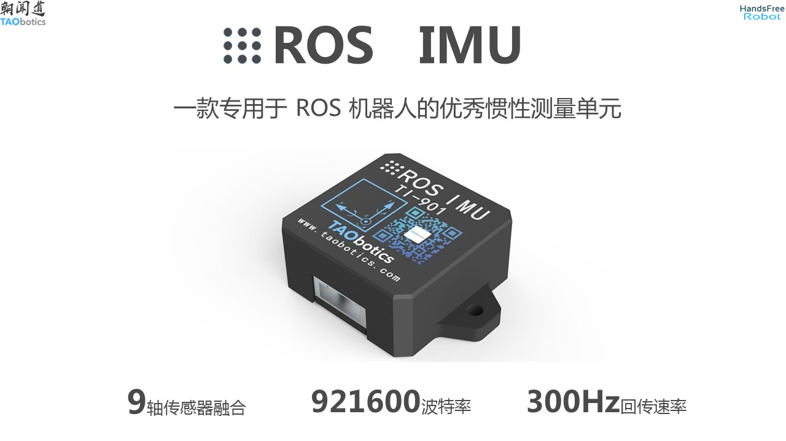
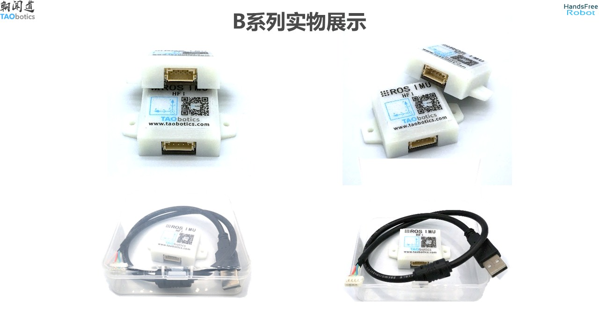
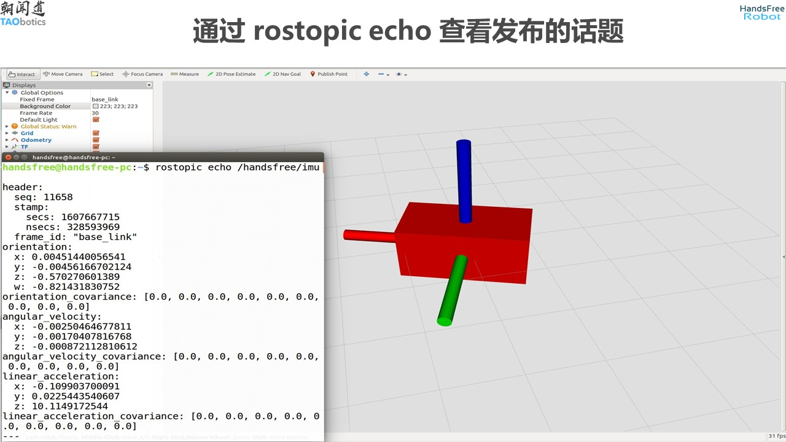
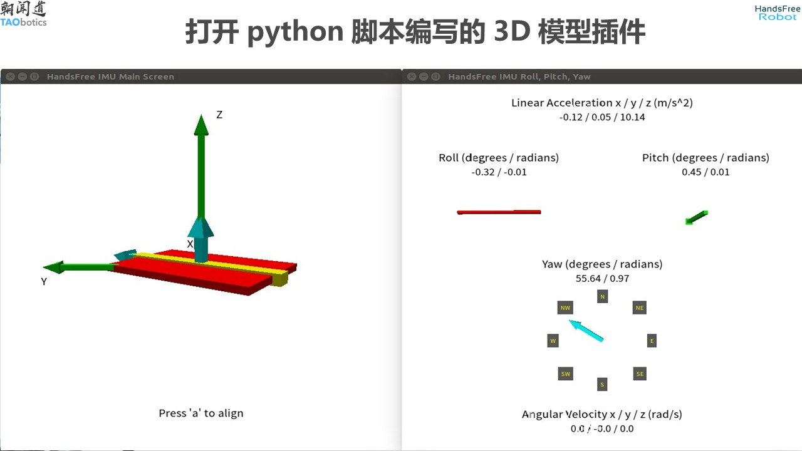
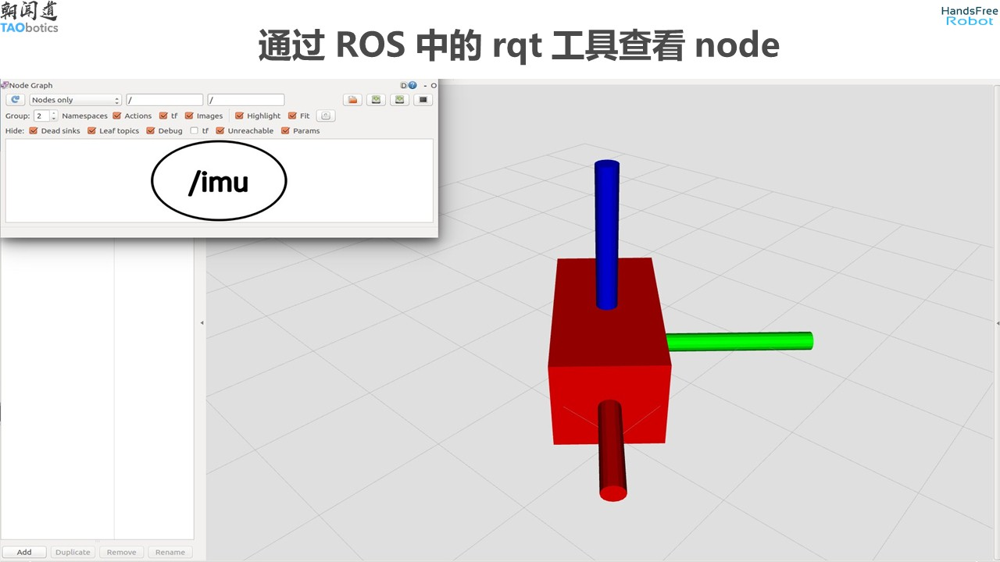
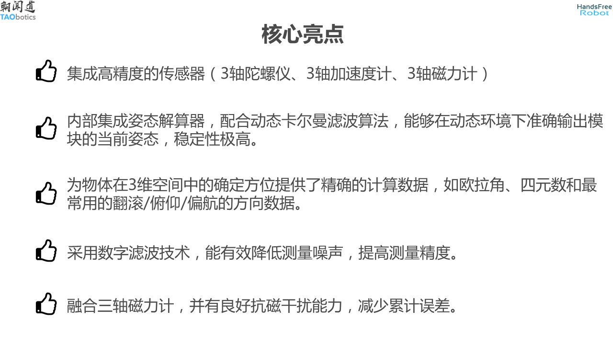
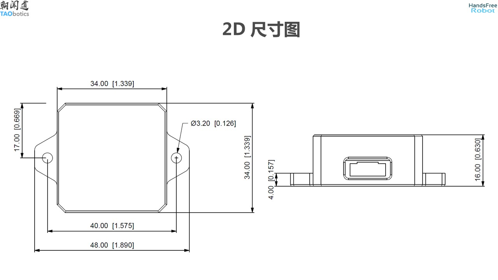
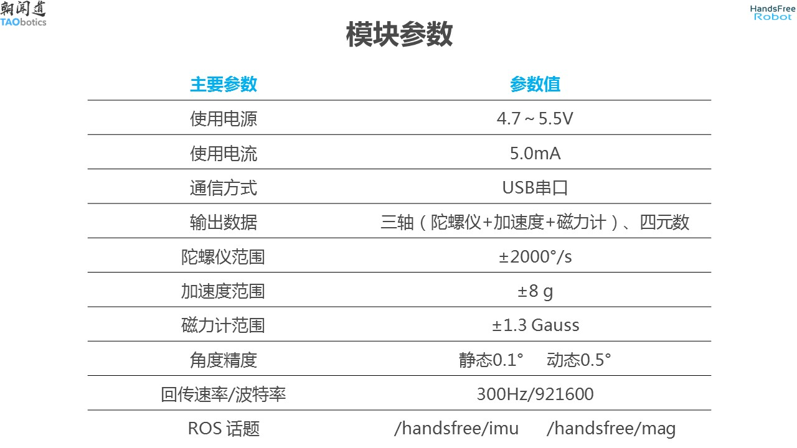
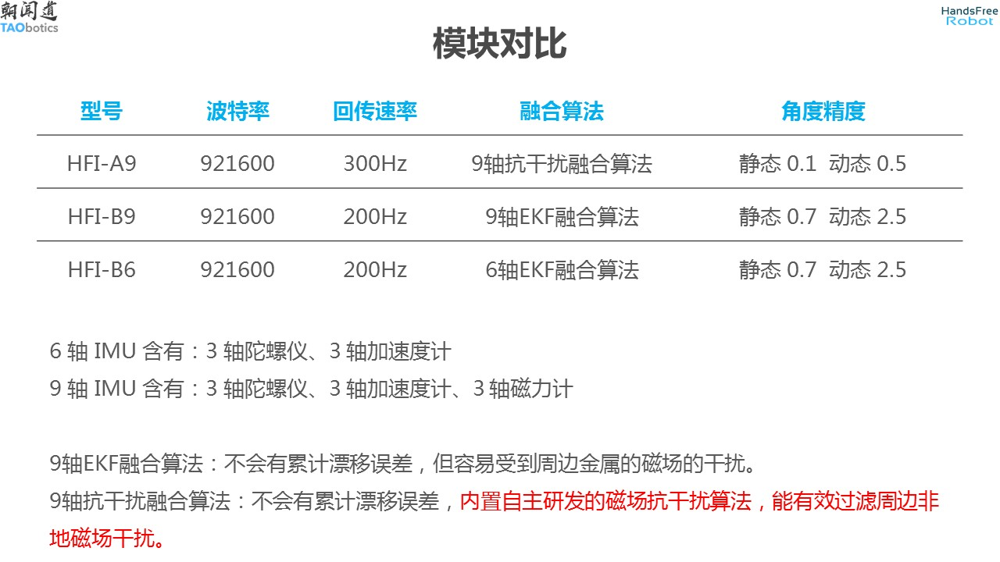
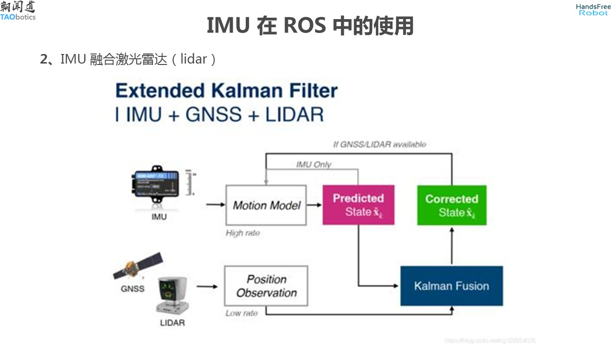

# HandsFree ROS IMU用户手册

handsfree_ros_imu 是用于学习使用 IMU 的 ROS 功能包，适用于 handsfree 推出的 3 款 ROS IMU。同时也含有纯 python 编写的输出数据显示, 支持 Linux、Windows 等相关的脚本文件。

rostopic：
* 陀螺仪和加速计发布的话题：/handsfree/imu
* 磁力计发布的话题：/handsfree/mag

[HandsFree ROS IMU 购买链接](https://item.taobao.com/item.htm?id=634027133148&ali_trackid=2:mm_26632258_3504122_32538762:1607955215_176_1820526432&union_lens=lensId:OPT@1607955206@212a8363_06ed_1766199523e_c878@01;recoveryid:201_11.27.58.136_21013517_1607955156105;prepvid:201_11.87.178.209_21008506_1607955206099&clk1=3e91f5613ddee8ba055d43c0368cfc9b&spm=a2e0b.20350158.31919782.18&pvid=100_11.182.77.179_11449_6761607955206647512&scm=null&bxsign=tbkozY1fyN0hsF81R/xTfHbTs5netRJ2MylEoFSlUg/Ds4QInP5TK8iioSmX2JM66JbK2KXA4JwODRwz0JptZUNTK3pfqvfvE6ObkDSU+tV8o4=)

## 教程文档

[《选型介绍》](./tutorials/imu_user_manual/02_选型介绍/doc.md)：内含 IMU 基础知识，常见选型问题，购买需知等。

[《配套软件包安装》](./tutorials/imu_user_manual/03_基础教程/01_配套软件包安装/doc.md)：内含 windows，Linux 和 Linux + ROS 下的使用。

[《Python驱动测试》](./tutorials/imu_user_manual/03_基础教程/02_Python驱动测试/doc.md)：内含 IMU 基础知识，常见选型问题，购买需知等

[《ROS 驱动测试和可视化》](./tutorials/imu_user_manual/03_基础教程/03_ROS驱动和可视化/doc.md)：ROS 驱动测试和可视化

[《里程计和 IMU 融合》](./tutorials/imu_user_manual/04_高级教程/01_里程计和IMU融合/doc.md)：以 A9 为例的 里程计 和 IMU 融合

[《GPS 和 IMU 融合》](./tutorials/imu_user_manual/04_高级教程/02_GPS和IMU融合/doc.md)：以 A9 为例的 GPS 和 IMU 融合

[《激光SLAM 和 IMU 融合》](./tutorials/imu_user_manual/04_高级教程/03_激光SLAM和IMU融合/doc.md)：以 A9 为例的 激光SLAM 和 IMU 融合

[《视觉SLAM 和 IMU 融合》](./tutorials/imu_user_manual/04_高级教程/04_视觉SLAM和IMU融合/doc.md)：以 A9 为例的 视觉SLAM 和 IMU 融合

[《问题和答疑》](./tutorials/imu_user_manual/05_问题和答疑/doc.md)：内含问题总结，如何提问，知识库和参考链接

[《附录-串口助手测试通讯》](./tutorials/imu_user_manual/06_附录/01_串口助手测试通讯/doc.md)：使用串口助手测试通讯

---

## 产品介绍

IMU 内有 加速度计，陀螺仪，磁力计这些传感器，通过固定 imu 到物体上后，可以获取物体在运动过程中的一些信息，如物体的三轴加速度信息，三轴角速度信息，三轴角度信息，三轴磁场信息。通过这些信息，可以得知物体运动过程中的状态。

IMU 设计的应用领域广泛，在军航空航天、航海、军事、医疗、娱乐、机器人、车辆等领域都有这重要的作用。

### 型号

产品型号共 3 种：

* A9：可获取三轴加速度信息，三轴角速度信息，三轴角度信息，三轴磁场信息。
* B9：可获取三轴加速度信息，三轴角速度信息，三轴角度信息，三轴磁场信息。
* B6：可获取三轴加速度信息，三轴角速度信息，三轴角度信息。

### 介绍

