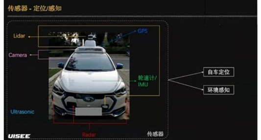

# 综合介绍

## 快速导航

[《选型介绍》](./../02_选型介绍/doc.md)：内含 IMU 基础知识，常见选型问题，购买需知等。

[《配套软件包安装》](./../03_基础教程/01_配套软件包安装/doc.md)：内含 windows，Linux 和 Linux + ROS 下的使用。

[《Python驱动测试》](./../03_基础教程/02_Python驱动测试/doc.md)：内含 IMU 基础知识，常见选型问题，购买需知等

[《ROS 驱动测试和可视化》](./../03_基础教程/03_ROS驱动和可视化/doc.md)：ROS 驱动测试和可视化

[《里程计和 IMU 融合》](./../04_高级教程/01_里程计和IMU融合/doc.md)：以 A9 为例的里程计和 IMU 融合

[《SLAM 和 IMU 融合》](./../04_高级教程/02_ SLAM和IMU融合/doc.md)：以 A9 为例的 SLAM 和 IMU 融合

[《问题和答疑》](./../05_问题和答疑/doc.md)：内含问题总结，如何提问，知识库和参考链接

[《附录》](./../06_附录/doc.md)：串口助手测试通讯

---

[HandsFree ROS IMU 购买链接](https://item.taobao.com/item.htm?id=634027133148&ali_trackid=2:mm_26632258_3504122_32538762:1607955215_176_1820526432&union_lens=lensId:OPT@1607955206@212a8363_06ed_1766199523e_c878@01;recoveryid:201_11.27.58.136_21013517_1607955156105;prepvid:201_11.87.178.209_21008506_1607955206099&clk1=3e91f5613ddee8ba055d43c0368cfc9b&spm=a2e0b.20350158.31919782.18&pvid=100_11.182.77.179_11449_6761607955206647512&scm=null&bxsign=tbkozY1fyN0hsF81R/xTfHbTs5netRJ2MylEoFSlUg/Ds4QInP5TK8iioSmX2JM66JbK2KXA4JwODRwz0JptZUNTK3pfqvfvE6ObkDSU+tV8o4=)

## 产品功能

IMU 内有 加速度计，陀螺仪，磁力计这些传感器，通过固定 imu 到物体上后，可以获取物体在运动过程中的一些信息，如物体的三轴加速度信息，三轴角速度信息，三轴角度信息，三轴磁场信息。通过这些信息，可以得知物体运动过程中的状态。

## 产品型号

产品型号共 3 种：

* A9：可获取三轴加速度信息，三轴角速度信息，三轴角度信息，三轴磁场信息。
* B9：可获取三轴加速度信息，三轴角速度信息，三轴角度信息，三轴磁场信息。
* B6：可获取三轴加速度信息，三轴角速度信息，三轴角度信息。

## 应用综合介绍

### 1、里程计和 IMU 融合

通过机器人运动学解算可以把测量到的电机运动数据转换成里程计数据，电机里程计通过扩展卡尔曼滤波融合 IMU 偏航(yaw)角的数据后，可以把机器人里程计的精度大大提升，称之为惯性融合里程计。

里程计的权重信息可以通过打滑碰撞检测模块来确定,通过检测电机的电流和编码器测量的电机速度以及 IMU 数据，来判断是否发生打滑和碰撞。若发生这些情况则意味着里程计会发生瞬间漂移，通过降低里程计的权重可以大概率的保障定位导航系统的可靠性。

### 2、视觉 SLAM 和 IMU 融合

视觉 SLAM 容易受图像遮挡，光照变化,运动物体干扰弱纹理场景等影响，单目视觉无法测量尺度，深度信息往往无法直接获取，仅通过单张图像无法获得像素的深度信息，需要通过三角测量的方法来估计地图点的深度。此外单目纯旋转运动无法估计，快速运动时易丢失。

视觉与 IMU 融合之后会弥补各自的劣势，可利用视觉定位信息来估计 IMU 的零偏，减少IMU由零偏导致的发散和累积误差。IMU 可以为视觉提供快速运动时的定位，IMU 可以提供尺度信息，避免单目无法测尺度 

### 3、GPS 和 IMU 融合

目前的 GPS 有很多时候是精度不够准确或者无效的，例如在隧道中经常因为信号不好无法使用，或者在市中心的高楼里 GPS 信号容易被折射反射。这个时候 IMU 就可以增强 GPS 的导航能力。例如，在车道线识别模块失效时，利用失效之前感知到的道路信息和 IMU 对汽车航迹的推演，仍然能够让汽车继续在车道内行驶。

此外，GPS 更新频率过低（仅有 10Hz）不足以提供足够实时的位置更新，IMU 的更新频率可以达到 100Hz 或者更高完全能弥补 GPS 所欠缺的实时性。GPS/IMU 组合系统通过高达 100Hz 频率的全球定位和惯性更新数据，可以帮助自动驾驶完成定位。通过整合 GPS 与 IMU，汽车可以实现既准确又足够实时的位置更新。

IMU 连同板载 ADAS 和卫星定位输入，提供精确的车辆位置和航向画面，同时抑制正常驾驶产生的冲击和振动。

### 4、其他

IMU 设计的应用领域广泛，在军航空航天、航海、军事、医疗、娱乐、机器人、车辆等领域都有这重要的作用。

## 宣传资料

