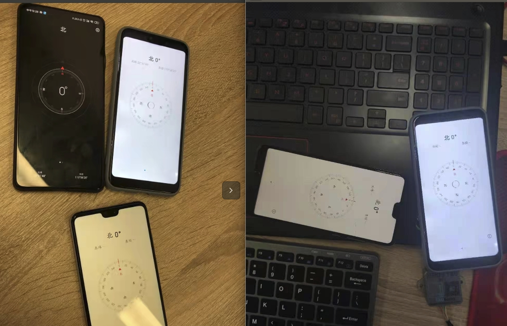

# 选型介绍

## IMU 基础知识

### 介绍

IMU 是**惯性测量单元**（英文：Inertial measurement unit）的简称，是测量物体三轴姿态角(或角速率)以及加速度的装置。

一般情况，一个 IMU 包含了三个单轴的加速度计和三个单轴的陀螺仪，加速度计检测物体在载体坐标系统独立三轴的加速度信号，而陀螺仪检测载体相对于导航坐标系的角速度信号，测量物体在三维空间中的角速度和加速度，并以此解算出物体的姿态。

陀螺仪和加速度计是 IMU 的主要元件，其精度直接影响到惯性系统的精度。在实际工作中，由于不可避免的各种干扰因素，而导致陀螺仪及加速度计产生误差，从初始对准开始，其导航误差就随时间而增长，尤其是位置误差，这是惯导系统的主要缺点。

一般 xx 轴 IMU区别。

1. 6 轴 imu：三个单轴的加速度计，三个单轴的陀螺仪
2. 9 轴 imu：三个单轴的加速度计，三个单轴的陀螺仪，三个单轴磁力计
3. 10 轴 imu：三个单轴的加速度计，三个单轴的陀螺仪，三个单轴磁力计，一个气压计

### 常见名称解析

**三轴陀螺仪:** 三轴陀螺仪是惯性导航系统的核心敏感器件，其最大的作用就是“测量角速度，以判别物体的运动状态，所以也称为运动传感器“

**三轴加速度计:** 是测量运载体线加速度的仪表

**磁力计:** 用于测试磁场强度和方向

**气压计:** 通过测量大气压强，来计算出高度

**6 轴融合算法:** 加速计对机体振动非常敏感，稍有扰动，加速度方向就会偏移（外力与重力的合力），但是长期运行时，经过平滑滤波算法之后的加速计数据就比较可信。相比而言，陀螺仪则对外部扰动不敏感，反而是长时间积分后会出现角度漂移。因此实际应用中，都是将二者采集的数据进行融合，相互取长补短。

**9 轴融合算法:** 由于机体水平时，加速度计无法测量绕 Z 轴的旋转量，即偏航角 yaw，并且磁力计也同样无法测得z轴的旋转量。所以使用加速度计和磁力计同时对陀螺仪进行校正。

**全姿态角:** 全姿态角（All attitude angle）用来描述对象在空间中的方位姿态，有飞机（导弹）姿态角和卫星姿态角之分。飞机姿态角是按欧拉概念定义的，故亦称**欧拉角** 。飞机姿态角是由机体坐标系与地理坐标系之间的关系确定的，用**航向角** 、**俯仰角** 和**横滚角** 三个欧拉角表示。不同的转动顺序会形成不同的坐标变换矩阵，通常按航向角、俯仰角和横滚角的顺序来表示机体坐标系相对地理坐标系的空间转动。

**零飘:** 一些因素导致电路输出端电压偏离原固定值而上下漂动的现象 它又被简称为：零漂。

**ROS 坐标系:** 请参考 [ROS 坐标系 - CSDN](https://blog.csdn.net/shixiaolu63/article/details/78496457)

**角度精度:** 请参考[倾角传感器中的精度是指什么 - CSDN](https://blog.csdn.net/ZITN001/article/details/104977227)

### 相关|参考链接

以下链接仅供参考

[惯性导航系统 - 百度百科](https://baike.baidu.com/item/%E6%83%AF%E6%80%A7%E5%AF%BC%E8%88%AA%E7%B3%BB%E7%BB%9F/2286423)

[惯性传感器 - 百度百科](https://baike.baidu.com/item/%E6%83%AF%E6%80%A7%E4%BC%A0%E6%84%9F%E5%99%A8/5302574)

[IMU（惯性测量单元）- 百度百科](https://baike.baidu.com/item/IMU/23629630?fr=aladdin)

[三轴陀螺仪 - 百度百科](https://baike.baidu.com/item/%E4%B8%89%E8%BD%B4%E9%99%80%E8%9E%BA%E4%BB%AA/3785697?fr=aladdin)

[加速度计 - 百度百科](https://baike.baidu.com/item/%E5%8A%A0%E9%80%9F%E5%BA%A6%E8%AE%A1)

[磁力计 - 百度百科](https://baike.baidu.com/item/%E7%A3%81%E5%8A%9B%E8%AE%A1/4560428?fr=aladdin)

[磁力仪 - 百度百科](https://baike.baidu.com/item/%E7%A3%81%E5%8A%9B%E4%BB%AA?fr=aladdin)

[气压计-百度百科](https://baike.baidu.com/item/%E6%B0%94%E5%8E%8B%E8%AE%A1)

[卡尔曼滤波 - 百度百科](https://baike.baidu.com/item/%E5%8D%A1%E5%B0%94%E6%9B%BC%E6%BB%A4%E6%B3%A2/5485372?fr=aladdin)

[全姿态角 - 百度百科](https://baike.baidu.com/item/%E5%85%A8%E5%A7%BF%E6%80%81%E8%A7%92)

[欧拉角/姿态角 - 百度百科](https://baike.baidu.com/item/%E5%81%8F%E8%88%AA%E8%A7%92/4783835#3)

[航空次序欧拉角 - 百度百科](https://baike.baidu.com/item/%E8%88%AA%E7%A9%BA%E6%AC%A1%E5%BA%8F%E6%AC%A7%E6%8B%89%E8%A7%92/15275390)

[四元素 - 百度百科](https://baike.baidu.com/item/%E5%9B%9B%E5%85%83%E6%95%B0/5795379)

[零点漂移 - 百度百科](https://baike.baidu.com/item/%E9%9B%B6%E7%82%B9%E6%BC%82%E7%A7%BB/3701123)

[IMU原理及姿态融合算法详解 - CSDN](https://blog.csdn.net/RoboChengzi/article/details/97616482)

[加速计陀螺仪6轴数据融合算法解析 - 知乎](https://zhuanlan.zhihu.com/p/80799574)

[ROS 坐标系 - CSDN](https://blog.csdn.net/shixiaolu63/article/details/78496457)

[倾角传感器中的精度是指什么 - CSDN](https://blog.csdn.net/ZITN001/article/details/104977227)

## 常见选型问题

A9 是性能最好的一款，并带有多年自主研发的抗磁场干扰算法。

1. IMU 使用环境下的磁场干扰大，且磁场干扰不稳定忽大忽小。

   > 建议选择 A9，该模块上电前会采集一次周围磁场数据进行初始化，内有抗磁干扰算法，在运动过程中的遇到突变的磁场能有效抵抗。

2. IMU 使用环境复杂，使用过程晃动幅度大

   >建议选择 A9，该模块使用 9 轴融合算法，自主研发的滤波算法。由于融合了磁场，累积误差将更小一些
   >
   >也可以选择 B9，该模块使用了 6 轴融合算法，累积误差大。需要用户自己研究磁场的融合，我们不提供融合磁场的相关帮助。

3. IMU 使用环境温和，使用过程中无较大晃动

   >可选择使用任意一款 IMU

## 购买需知

1. 我们的 IMU 模块主要用于 ROS，且代码是使用 python 编写的，也只有 python 编写的代码。
2. 提供协议文档，用户可根据自身需求来自己编写其他语言的驱动。
3. 在 window 和 linux 下提供的 UI 界面数据打印的的 demo 和 数据打印的 demo（不需要依赖 ROS），共用户参考 

### A9 型号

* 9 轴 IMU。
* 9 轴融合算法。
* 自主研发滤波算法。
* 自主研发抗磁干扰算法，有效防止磁场的干扰。上电初始化成功后生效。
* 输出频率 150 HZ。
* yaw 值为 0 时， x 轴会指向北方。
* 上电后会有10 秒左右的时间进行初始化，期间会将周围的磁场数据初始化到模块内，所以不一定会指向正北方，跟模块所在环境的磁场有一定关系。
* IMU 模块需要**静置启动** ，否则模块会自动切换到动态启动，零飘会采用到 flash 中的存储值，一般会有产生较大的偏差。
* 静态精度 0.1 动态精度 0.5

### B9 型号

* 9 轴 IMU
* 6 轴融合算法
* 卡尔曼滤波算法
* 输出频率 200 HZ
* **静置启动后** ，会初始化当前 IMU 模块姿态的 yaw， pitch， roll 为零，并以模块当前 x, y, z 轴的指向建立坐标系
* 提供磁力计的输出，但是没有提供磁力计的融合
* 静态精度 0.7 动态精度 2.5  

### B6 型号

* 6 轴 IMU
* 6 轴融合算法
* 卡尔曼滤波算法
* 输出频率 200 HZ
* **静置启动后**，会初始化当前 IMU 模块姿态的 yaw, pitch, roll 为零，并以模块当前 x, y, z 轴的指向建立坐标系
* 静态精度 0.7 动态精度 2.5

### 其他

A9 型号的 IMU 模块，yaw 值为零时，x 轴应该指向北方。但是由于模块上电后会有10 秒左右的时间进行初始化，期间会将周围的磁场数据初始化到模块内，所以不一定会指向正北方，跟模块所在环境的磁场有一定关系。也请用户不要用手机的指南针参考，不一定准确，如下图中不同手机指南针的对比。

若偏差太多，请确定参考指向无误，尝试断电后，**静置模块**，然后连接 USB 测试。（仅 A9 模块）

检测三轴加速度的输出，三轴角速度，三轴磁力计（A9 和 B9 需要查看磁力计），三轴欧拉角数据是否有输出。

如果无法判断是模块的问题还是代码某些依赖没有安装成功导致数据没有输出，请参考下面的教程来通过串口助手快速判断模块输出的数据是否有误。
