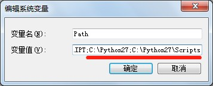
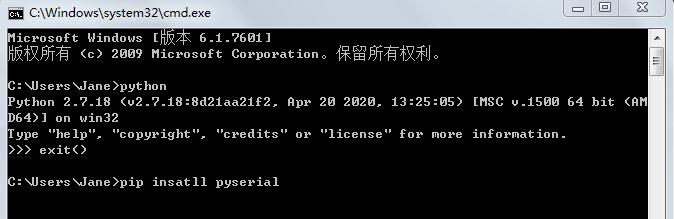
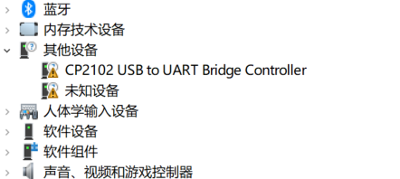

# 配套软件包安装

## Windows 下安装软件包（无需安装 ROS）

以 win7，python2.7 为例

1. 安装 python2.7 并配置相关的环境 python 环境和 pip 环境

   前往官网下载 python2.7，并进行安装，下载地址：[python2.7下载地址](https://www.python.org/downloads/)（若进不去，可通过其他途径下载）

       

   以上图为例，是默认安装的 python 所在目录，Scripts 目录有 pip 工具

2. 通过 cmd 命令处理器检测 python 是否安装成功，同时通过 pip 下载 pyserial 串口模块

       

   以上图为例，通过输入 python 来检测 python2.7 是否安装成功。输入 exit() 退出。

   然后通过 pip install pyserial 来安装串口模块

3. 下载并安装 cp2102 串口驱动，下载地址: [cp2102驱动](https://handsfree-mv.oss-cn-shenzhen.aliyuncs.com/handsfree_robot/tools/windows%E4%B8%B2%E5%8F%A3%E9%A9%B1%E5%8A%A8/CP2102.zip)。  
一般情况下，设备连接到电脑后，电脑将自动下载驱动。您可以点击 此电脑->属性->设备管理器 查看驱动是否有正常安装。
如果您的端口设备如下图所示，则安装成功：  

  如果您的端口设备出现黄色感叹号等异常情况，则安装失败，需要自行手动安装驱动：


4. 下载驱动软件压缩包，并解压到桌面。

   [【点击跳转至下载页面】](https://gitee.com/HANDS-FREE/handsfree_ros_imu/repository/archive/master.zip)


## linux 下使用安装软件包（无需安装 ROS）

以 ubuntu16.04，python2.7 为例

1. 下载驱动软件压缩包，然后鼠标右键，选择提取到此处。

   [【点击跳转至下载页面】](https://gitee.com/HANDS-FREE/handsfree_ros_imu/repository/archive/master.zip)


## linux + ROS 下使用安装软件包（需要安装好 ROS）

1. 安装 ROS IMU 依赖，请在终端运行对应的命令

   如果你使用的是 ubuntu 16.04，ROS kinetic，python2 :

   ```
   sudo apt-get install ros-kinetic-imu-tools ros-kinetic-rviz-imu-plugin
   sudo apt-get install python-visual
   ```

   如果你使用的是 ubuntu 18.04，ROS Melodic，python2 :

   ```
   sudo apt-get install ros-melodic-imu-tools ros-melodic-rviz-imu-plugin
   ```

   如果你使用的是 ubuntu 20.04，ROS Noetic，python3 :

   ```
   sudo apt-get install ros-noetic-imu-tools ros-noetic-rviz-imu-plugin
   pip3 install pyserial
   ```

2. 下面以官方安装为例，你也可以根据自身使用的情况来安装。

   ```
   sudo apt-get install git -y
   mkdir -p ~/handsfree/handsfree_ros_ws/src/
   cd ~/handsfree/handsfree_ros_ws/src/
   git clone https://gitee.com/HANDS-FREE/handsfree_ros_imu.git
   cd ~/handsfree/handsfree_ros_ws/
   catkin_make
   cd ~/handsfree/handsfree_ros_ws/src/handsfree_ros_imu/scripts/
   sudo chmod 777 *.py
   echo "source ~/handsfree/handsfree_ros_ws/devel/setup.sh" >> ~/.bashrc
   source ~/.bashrc
   ```

   
