# Python 驱动测试
## windows 下测试
以 win7，a9，python2.7 为例，测试 `handsfree_ros_imu-master\demo\windows\` 目录下的 `hif_a9.py` 和 `hif_a9_ui.py`文件。

1. 插上 IMU 的 USB 设备，检查电脑能否识别到 `Silicon Labs CP210x USB to UART Bridge（COM*）`\* 指任意数字。如果有多个 `Silicon Labs CP210x USB to UART Bridge（COM*）` 请重新拔出一下 IMU 的 USB，记一下 IMU 被电脑识别到的 COM 口是多少。

   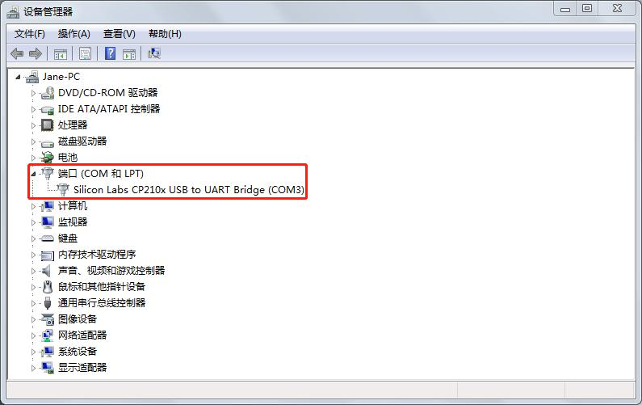

2. 进入脚本目录，修改对应的 python 脚本中 COM3（脚本默认用的 COM3） 为你电脑识别出来的数字

   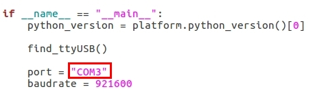

3. `Win+R` 打开一个标题为运行的窗口，在输入框输入 `cmd`，回车后出现的命令字符界面（一开始通过该字符界面运行可以看到为运行后的报错，方便根据报错提示来安装缺少的依赖或排查未运行成功的原因）。通过 `cd` 命令前往脚本所在目录，然后通过 `python` 命令来运行脚本文件。下图为 hfi_a9.py 驱动运行成功后的截图，运行成功后正常情况会不停打印以下信息。

   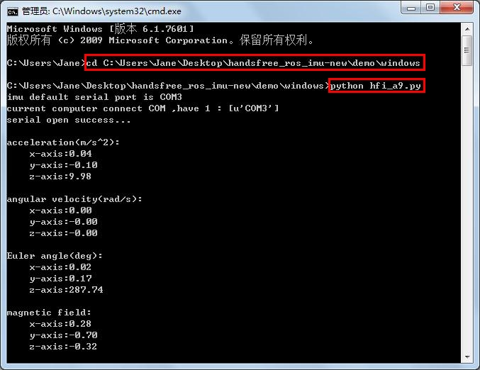  
当然您也可以通过一个更简便的方法打开文件所在路径的终端：  
首先，打开您存放`python`文件的目录
   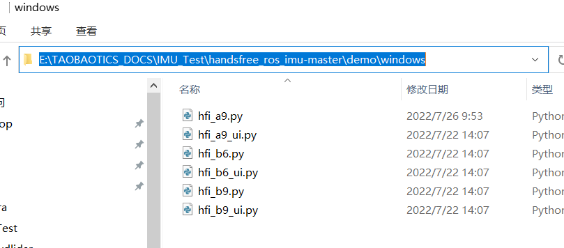  
鼠标点击文件地址栏，输入`cmd`并回车，即可直接打开一个在当前目录下的终端，省去了用 `cd` 命令进入文件夹的琐碎过程。
   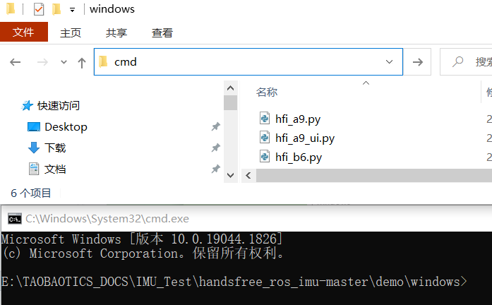

4. 同理，下图 hfi_a9_ui.py 运行成功后的截图。标题为 handsfree imu 的窗口，里面的数据将会打印出来。 

   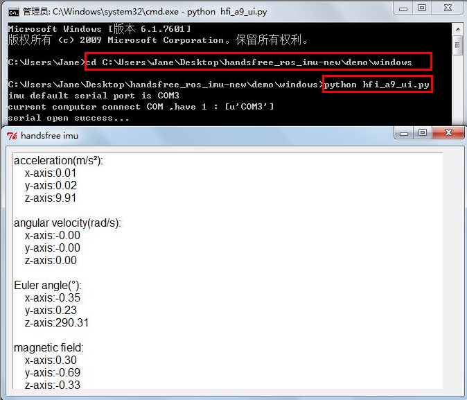
如果您的电脑之前有用`anaconda`配置了不同的python版本环境，则您可能会在运行`python` demo时遇到以下问题：
 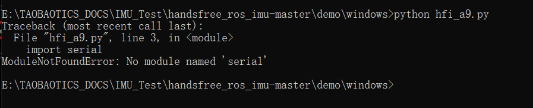
即在已经安装了`serial`模块的情况下，当你运行程序时，终端仍然显示找不到该模块。
这很可能是因为您的电脑有多个python环境，导致用 `pip install` 的时候 `serial` 安装到了另外某个 `python`  的 `site-packagees` 下，而不是当前所使用的 `python` 的 `site-packagees`。  
解决方法：
打开一个新的终端，输入`python` 指令来运行python，并执行以下两条指令:
   ```
   > import os
   > print(os.path)
   ```
   接着终端会显示诸如： `xxx/anaconda3/lib/python3.8/posixpath.py` 的路径信息  
接下来只要根据提示信息重新安装pyserial模块即可( `pip install pyserial --target=xxx/anaconda3/lib/python3.8/site-packagees` )。  
以下为实际例子演示：  
在个人电脑里输入以下指令，终端会显示我当前所用的python路径：
 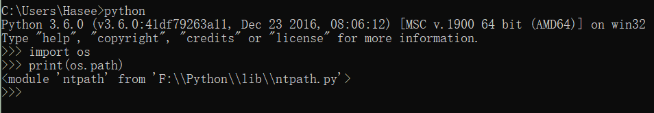

   根据路径，找到该Python对应的site-packages路径：
 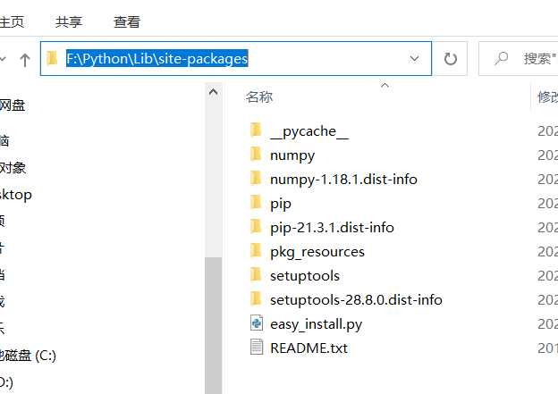

   在cmd里执行命令： `pip install pyserial --target=F:/Python/Lib/site-packages` (注意更改路径中的反斜杠为正斜杠)，此时再运行`python` demo 文件，即可正常运行。

 


## linux 下测试

以 ubuntu16.04，a9，python2.7 为例，测试 `hif_a9.py` 和 `hif_a9_ui.py`

1. 先不要插 IMU 的 USB ，在终端输入 `ls  /dev/ttyUSB*` 来检测一下，然后在将 USB 插入电脑，再在终端输入 `ls  /dev/ttyUSB*` 来检测一下，多出来的 ttyUSB 设备就是 IMU 的串口。

   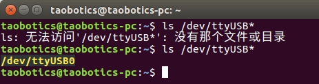

2. 进入脚本目录，修改对应的 python 脚本中 /dev/ttyUSB0（脚本默认用的 /dev/ttyUSB0） 为你电脑识别出来的数字

   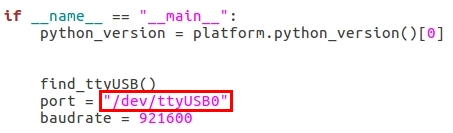

3. 可通过 `cd` 命令到脚本所在的目录，也可以在脚本所在的目录打开终端，然后通过 `python` 命令运行脚本。下图为 hfi_a9.py 驱动运行成功后的截图。

   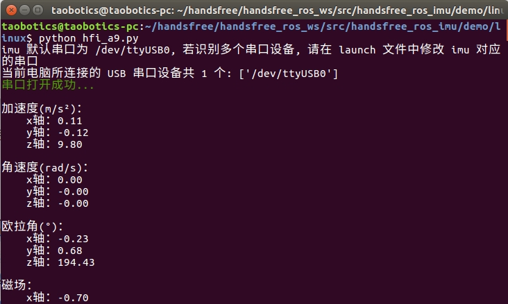

   如果在该过程中，您遇到了`串口打开失败`的情况：
   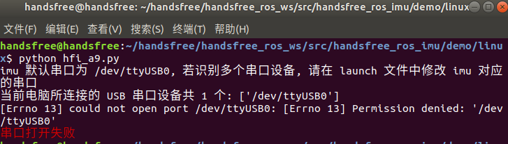  
   则需要先输入以下指令，再进行串口打开操作：
   ```
   > sudo chmod 777 /dev/ttyUSB0	(ttyUSB0为您个人所检测到的接口名字）
   ```
4. 同理，下图 hfi_a9_ui.py 运行成功后的截图。标题为 handsfree imu 的窗口，里面的数据将会打印出来。 

   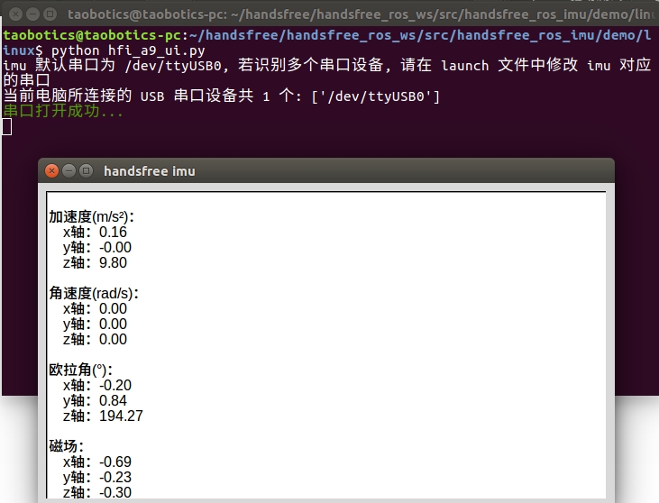
