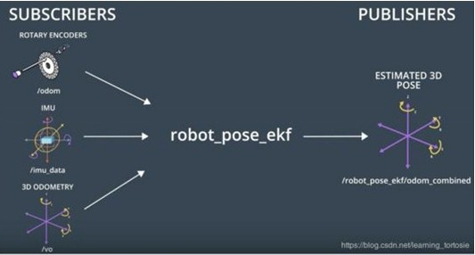

# 里程计和 IMU 融合

通过机器人运动学解算可以把测量到的电机运动数据转换成里程计数据，电机里程计通过扩展卡尔曼滤波融合 IMU 偏航(yaw)角的数据后，可以把机器人里程计的精度大大提升，称之为惯性融合里程计。

里程计的权重信息可以通过打滑碰撞检测模块来确定,通过检测电机的电流和编码器测量的电机速度以及 IMU 数据，来判断是否发生打滑和碰撞。若发生这些情况则意味着里程计会发生瞬间漂移，通过降低里程计的权重可以大概率的保障定位导航系统的可靠性。

请等待更新。
