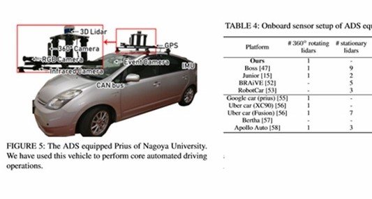

# GPS 和 IMU 融合

目前的 GPS 有很多时候是精度不够准确或者无效的，例如在隧道中经常因为信号不好无法使用，或者在市中心的高楼里 GPS 信号容易被折射反射。这个时候 IMU 就可以增强 GPS 的导航能力。例如，在车道线识别模块失效时，利用失效之前感知到的道路信息和 IMU 对汽车航迹的推演，仍然能够让汽车继续在车道内行驶。

此外，GPS 更新频率过低（仅有 10Hz）不足以提供足够实时的位置更新，IMU 的更新频率可以达到 100Hz 或者更高完全能弥补 GPS 所欠缺的实时性。GPS/IMU 组合系统通过高达 100Hz 频率的全球定位和惯性更新数据，可以帮助自动驾驶完成定位。通过整合 GPS 与 IMU，汽车可以实现既准确又足够实时的位置更新。

IMU 连同板载 ADAS 和卫星定位输入，提供精确的车辆位置和航向画面，同时抑制正常驾驶产生的冲击和振动。

请等待更新。
