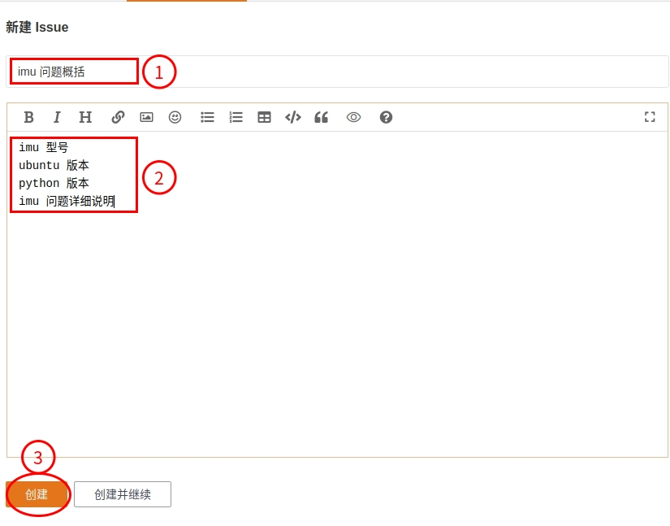

# 问题和答疑

## 问题总结

### 通用问题

1. IMU 模块到手后需要校准吗？ 

   > 我们的 IMU 模块在出厂前已近校准好了，可以直接上手使用。    
   > 模块在出厂前做了单温度条件下的陀螺仪、加速度计和磁力计的较为完整的常规标定，其中后两者是采用相对量进行标定的。陀螺仪附加有额外的零点标定。 

2. IMU 模块搭配的通讯线太短，我需要一根更长的线该怎么办？    

   > 可以在市面上购买长度合适的 USB 延长线来加长。

3. 如何快速确认 IMU 模块通信是否正常？    

   > 可以通过串口助手快速确认，请参考附录中串口助手测试通讯来测试一下。

4. 我想要修改 IMU 模块的一些配置，如波特率，输出频率等，可以修改吗？    

   > 目前的 IMU 模块不支持用户修改波特率，输出频率等相关的配置，批量采购可支持定制。

5. IMU 稍微动一动，程序就没有数据输出了怎么办？    

   > 可能是 IMU 通讯线某一端接触不良导致。先排查 USB 端，换个 USB 口测试看看。如果还是不行，从新插拔一下 IMU 端的通讯线。（请多测试几次，进行确认。）确定是线的问题，请联系售后补发一根线。（发货时有检测 IMU 通信线好坏，以及接触是否良好，一般不会出现此问题。）

6. 请问有没有 3D 模型示例？    

   > 有的，但是只有后缀为 .STEP 的 3D 模型文件，在某个目录下，请自行找一下。

7. 请问有没有通讯协议？    

   > 有的，在某个目录下，请自行找一下。

8. 模块的输出能直接进裸机吗？    

   > 只提供了 USB 串口输出

9. 关于 yaw 的初始值？   

   > a 系列 IMU 模块初始化会将北初始化到模块所在位置的磁场北，而不是地磁北（因为大多数情况有磁场干扰），该磁场北就是放一个指南针在该处，指南针指北的方向，即该处磁场磁力线方向，它是地磁场和干扰磁场的矢量和的方向。    
   > b 系列 IMU 模块以上电前静止的姿态初始化 yaw 值为零

10. b9 每次初始的姿态好像是0，而不是相对于东北天的姿态，我想直接得出 ARHS 怎么搞呢？    

    > b9 没有将磁力计的融合，只提供了磁力计的输出信息，需要用户自己进行融合处理。

11. 角度输出计算过程，考虑了地磁吗？    

    > a9内部有做地磁的融合处理，和抗磁干扰，角度的输出是已经计算好的，可以不用考虑。    
    > b系列角度输出计算没有考虑地磁    

12. 角速度的滤波有融合地磁？   

    > 没有

13. 静态和动态精度？    

    > 静态精度： 静态精度就是模块转到一个角度后停下来测量，另外我们自己的定义中，被拓宽到了在三轴转台上包含转台缓慢三维转动时的测量。静态测量用三轴转台测量。    
    > 动态精度：动态精度即既包括动态转动也包括施加横向加速度时候的实时测量。动态测量用摇摆台或者在实际工况中用一个高精度imu（比如光纤的）作为参考，进行对比测量。    
    > A9 静态精度 0.1 动态精度 0.5    
    > B9 静态精度 0.7 动态精度 2.5    

14. IMU 是东北天坐标系么？    

    > IMU的坐标系是ros默认的坐标系，没有考虑北东地/东北天，IMU 获取的数据都是没有问题，可在代码中稍加修改，达到需要数据输出规则。 

15. x、y、z 轴的加速度不太对，我静止放在桌面，x、y 轴加速度不为零。    

    > 模块不可能绝对水平，静止在比较平的桌面，x、y 轴加速度会在 0.0 左右，z 轴加速度在 9.8 左右。

16. 磁力计x轴，假设当前值为 a, 在水平面内转 180 度的话，是不是应该等于 -a ？    

    > 在环境没有磁干扰的情况下，是这样的。

17. 请问为什么我旋转 Y 轴到 90 度后，z 轴会有特别大的变化？    

    > 角度是加速度各轴分量求出来的，接近 90度的时候，分母为0，也就进入了奇点。    
    >
    > 欧拉角表示姿态的时候，会有奇点现象。奇点位置和欧拉角的旋转顺序有关。比如欧拉角的旋转顺序定义为Z-Y-X，那么Y轴±90°为奇点位置。如果旋转顺序定义为Z-X-Y，那么X轴±90°为奇点位置。我们的模块按照Z-Y-X定义。可以这么理解，Z轴表示方向角，相当于X轴朝向。当Y轴为90度，X朝向上方，就Z轴为任何角度都表示的同一个姿态，没有意义。另外，假设X轴为0度，Z轴为0度。Y轴 由89°变为91°，姿态会由【0，89，0】，【180，91，180】，也X轴角度发生了0~180°的突变，Z轴也发生了突变。    
    >
    > 这个和飞行器仪表的行为是一致的，比如飞行模拟软件/游戏里面，把飞机拉升到接近90度的位置，航向就会抖动。    

18. z 轴角度是磁北极角度？还是函数修正到地球的北极角度？    

    > 磁北极（地磁北极）。

19. 这个设备每过多久就有累积误差了？

    > IMU 的累积误差是随时间一直积累的，并且不同的使用环境累积误差是不一样的。

20. IMU 发送的数据是不是已经经过卡尔曼滤波处理过了？

    > b 系列用的是卡尔曼滤波，a 系列用的自主研发的滤波来处理的。

21. IMU 这款的几何尺寸有吗？

    > 有的，在某个目录下，是图片文件

22. a9 上电后 yaw 不准，不指向正北。

    > 模块上电前会采集周围的磁场数据，并不一定会指向正北，会有偏差，偏差大小一般和周围的磁场有关或模块没有静置启动。确保模块周围没有可以干扰磁场的，模块保持静止（ 可以用书本压一下），然后在将 usb 线连接到电脑，注意在连接电脑的时候线不要带动模块，然后测试看看。  
    >
    > 需要注意的是如果用其他设备上的传感器测出的正北，并不具备参考性，比如手机，在某些情况下其指向也会有很大的偏差。

23. 请问有这个 IMU 工作原理介绍之类的资料吗？    

    > 没有，IMU 的工作原理大都相同，网上可以找到相关的资料。

24. 请问有IMU的电路图吗？
	>没有。

25. A9模块上电后用串口工具查看数据异常是什么问题？

    > A9模块上电后会有几秒钟时间初始化，初始化完成后数据就显示正常了。

26. 根据官方提供的ros安装教程出现问题，apt无法安装对应的包？

    > 可能是本地的apt源里没有这个包，所以请自行Google换源教程，更换本机apt源之后再尝试安装。

27. pip安装serial后运行报错Import：No model named serial是什么问题？

    > 请检查本机的pip 的 python版本和运行代码的python版本是否一致，具体检查教程请自行Google。

28. IMU上电之后yaw会很漂是什么问题？

    > 可能是本机的USB口供电不稳定导致的，请更换载体设备进行测试或者给IMU提供单独的供电，比如用一个有单独供电的USB 扩展坞。


### Linux & ROS 下的问题

1. 请问你们的 IMU 有融合案例吗？    

   > 我们这边目前还没有 IMU 相关的融合案例，可以到网上找一下相关的案例研究一下。

2. 请问为什么每次ros启动都要重新给 ttyUSB* 权限？    

   > 请尝试以下命令，看看是否可行    

   ```
   sudo touch /etc/udev/rules.d/handsfree-IMU.rules
   sudo sh -c 'echo "KERNEL==\"ttyUSB*\",GROUP=\"uucp\",MODE=\"0777\"" >> /etc/udev/rules.d/handsfree-IMU.rules'
   sudo service udev reload
   sudo service udev restart
   sudo usermod -a -G dialout $USER
   ```

3. 请问这款 IMU 有没有移动路径计算的例程？    

   > 没有

4. 请问IMU和其他传感器的时间同步怎么做呢？    

   > 可以从 ros 时间戳入手，需要您自己在网上查阅相关资料。

5. 请问有没有用这个IMU和里程计做融合的示例啊？自己试了，经常报错。网上也找不到解决方案。    

   > 目前还没有

6. 无法安装依赖    

   > 依赖都是可以安装的，请检测你的源是否正确，可参考网上教程排查设置一下。

7. 有没有办法固定 IMU 对应的 ttyUSB？我有好几个串口，经常每次重启都会乱？    

   > 可以尝试更改一下 usb 规则


### Windows 下的问题

1. 怎么确定我的 python 是否安装成功？

   > 可以参考一下网上的教程，以及如何验证安装成功的教程。

2. 关于 pip 安装命令会失败，是什么导致的？

   > 可能需要根据命令行提示升级pip，或需要添加 pip 的环境。


## 如何提问

### 如何通过 Issues 来提问

1. 前往 [Issues 页面](https://gitee.com/HANDS-FREE/handsfree_ros_imu/issues)

2. 创建一个 Issue，选择新建 Issue

   

3. 发布一个提问，请按照图片中的格式来提问，谢谢

   

4. 请等待回答，我们会尽快处理您的问题，等待过程中可以浏览其他文章。


### 问题回答说明

1. 一些描述不清或话述不通问题可能导致答疑人员无法快速回答，请尽可能的描述清楚问题。
2. 我们仅提供相关 IMU 模块的回答，如运行上的问题，输出数据上的问题等。
3. 您也可以问复杂的问题，这些问题我们不一定会回答。也许能等到和你研究方向一致的用户，来讨论。
4. 可以给出建议性质的 iessu，我们会虚心采纳建议，完善我们的功能包。


## 知识库和参考链接

### 名词说明

**IMU：** Inertial Measurement Unit首字母的缩写，即惯性测量单元。

**地磁北：** 地磁北极是地球表面地球磁场方向垂直向下的点。地磁北极与地理北极并不相同。地磁北极正在不断的改变，以每天20.5米的速度移动。另外，由于地球磁场并不是完全对称的，地磁北极与地磁南极并不是处在对跖点位置上。

**地理北极：** 北极是指地球自转轴的北端，也就是北纬90°的那一点，不随时间变化。

**unity：** Unity是实时3D互动内容创作和运营平台。包括游戏开发、美术、建筑、汽车设计、影视在内的所有创作者，借助Unity将创意变成现实。Unity平台提供一整套完善的软件解决方案，可用于创作、运营和变现任何实时互动的2D和3D内容，支持平台包括手机、平板电脑、PC、游戏主机、增强现实和虚拟现实设备。


### 参考连接

[[1] IMU （惯性测量单元）--百度百科](https://baike.baidu.com/item/IMU/23629630?fr=aladdin)

[[2] AHRS（航姿参考系统）--百度百科](https://baike.baidu.com/item/AHRS)(内有 AHRS 和 imu 区别)

[[3] 北东地/东北天两种导航坐标系与姿态转换](https://blog.csdn.net/zht2370201/article/details/89313370)（CNDS）

[[4] 地磁北极--百度百科](https://baike.baidu.com/item/%E5%9C%B0%E7%A3%81%E5%8C%97%E6%9E%81/2753037?fr=aladdin)

[[5] 磁北极--百度百科](https://baike.baidu.com/item/%E7%A3%81%E5%8C%97%E6%9E%81/9991751?fr=aladdin)

[[6]北极--百度百科](https://baike.baidu.com/item/%E5%8C%97%E6%9E%81/130657?fr=aladdin)(地理北极)

[[7]卡尔曼滤波--百度百科](https://baike.baidu.com/item/%E5%8D%A1%E5%B0%94%E6%9B%BC%E6%BB%A4%E6%B3%A2/5485372?fr=aladdin)

[[7]AHRS 和 IMU的区别](https://blog.csdn.net/weixin_28949185/article/details/90581630?spm=1001.2014.3001.5502)（CNDS）