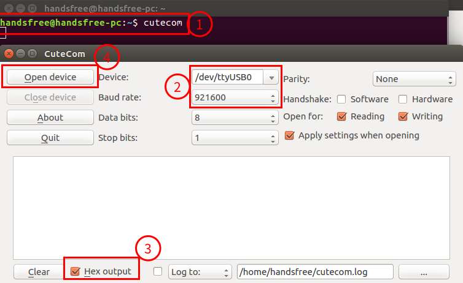
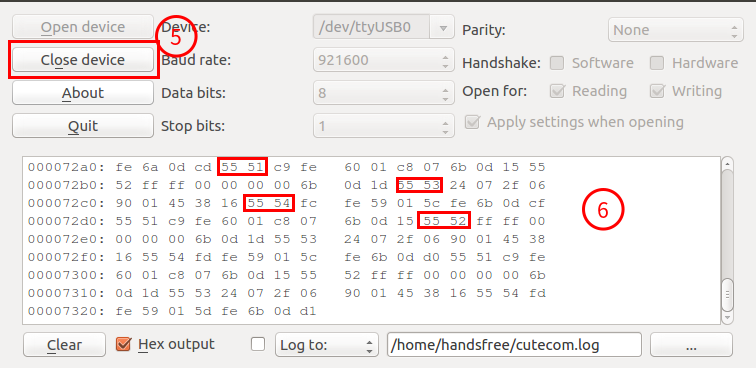
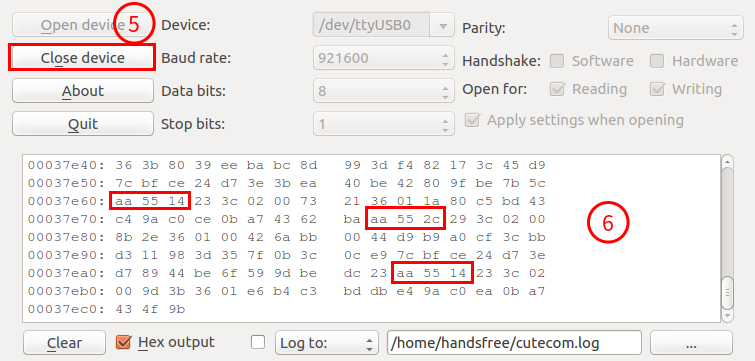
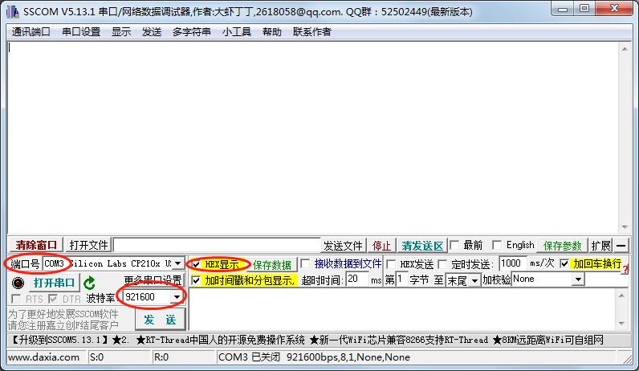
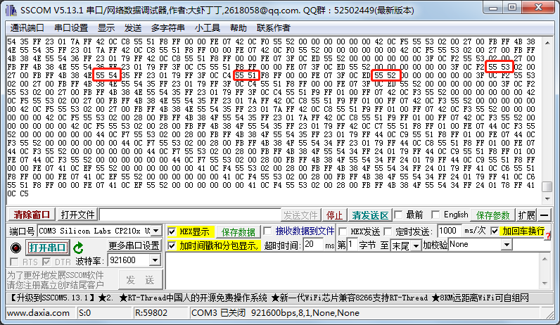
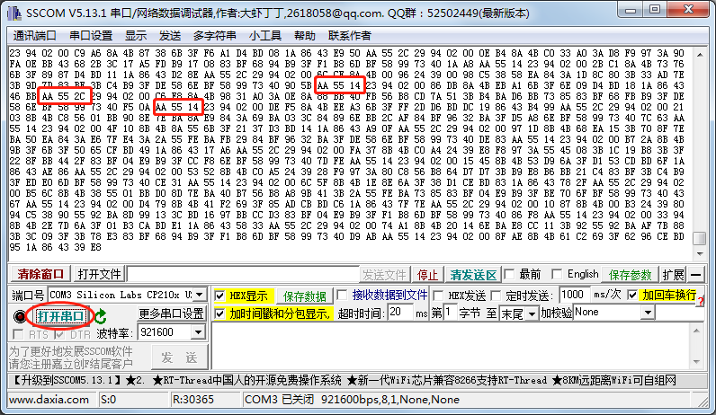

# 串口助手测试通讯

## 在 ubuntu 上使用串口助手

以 ubuntu16.04 为例，波特率 921600

1. 安装 cutecom（你也可以安装其他的串口助手进行调试）。

   ```
   apt-get install cutecom -y
   ```

2. 安装成功后在终端输入 cutecom，打开串口助手，然后进行一些设置，如图中所示。  

   

   如果您在点击`open device` 后，cutecom提示`no device has been specified` 则您要通过`sudo cutecom`来启动串口助手。

3. 然后我们点击`open device` ，此时下面的空白面板会有 imu 的数据打印。


4. 我们可以等待 imu 的数据打印一会儿，然后点击 `close device`来查看。

5. 如果可以找到一以下的信息，那么模块发送的数据是没有问题的。

   `55 51`、 `55 52`、 `55 53`、 `55 54` 是 b 系列 imu 模块特有的数据。

   `aa5514`、`aa552c` 是 a 系列 imu 模块特有的数据。

    

    

6. 提示：如果你的电脑上有多个 `/dev/ttyUSB*` 设备，请确定 imu 模块对应的设备号，然后在填到cutecom的 `device:`对应的可输入下拉框。查看所有 ttyUSB* 设备可在终端输入。

   ```
   ls /dev/ttyUSB*
   ```

## 在 windows 上使用串口助手

以 win 7 为例，波特率 921600

1. 运行包中自带 [sscom5.13.1.exe](https://gitee.com/HANDS-FREE/handsfree_ros_imu/blob/9124c6a25d3e5df55c42c8d9a853ec57f5ad45ab/tutorials/%E7%9B%B8%E5%85%B3%E8%B5%84%E6%96%99/%E8%BD%AF%E4%BB%B6%E5%B7%A5%E5%85%B7/sscom5.13.1.exe) （你也可以使用自己的串口助手工具）。

2. 进行一些设置，如图中所示。

   

3. 打开串口，等数据打印一会在关闭串口，查看打印的数据。

   `55 51`、 `55 52`、 `55 53`、 `55 54` 是 b 系列 imu 模块特有的数据。

   `aa5514`、`aa552c` 是 a 系列 imu 模块特有的数据。

    

    

   

